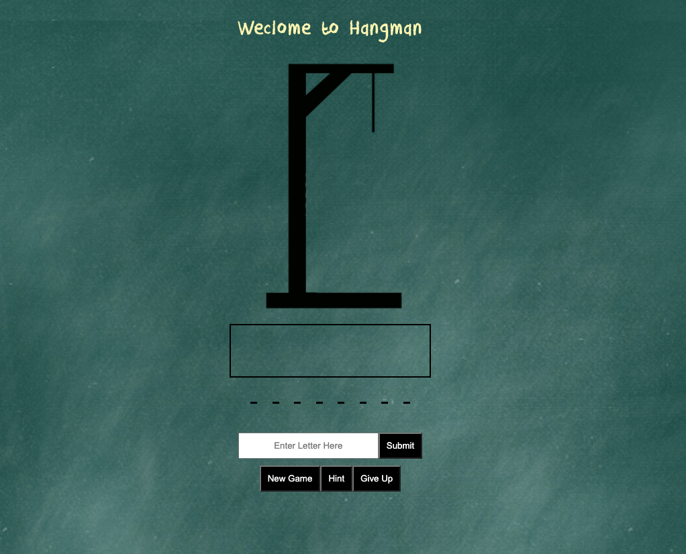

__HangMan Game__

__Deployed Link__
https://cpassafaro.github.io/Hangman_Game/

__Sample__
***

__Description__

This is a mock-up of a traditional hangman game. The game is set up to only play eight letter words. The player gets eight guesses until they lose the game. There is a collection of words that are chosen from in the javascript file. One could change the array of words to take away or add more words to the discoverable options. Players can input one letter at a time into the submission box. They can click or hit enter to submit their letter. Once their letter is submitted it is evaluated as either a correct letter or an incorrect letter. 

The letter box that stores discarded letters is being populated as the player guesses incorrectly. However the area where the correct letters are stored. The correct letters are already there at startup and are being revealed if the player guesses them correctly.

If the letter is incorrect the letter will be added to the box of incorrect letters. This box will populate up to seven letters and then on the eighth incorrect guess the game will be over. If the same wrong letter is guessed twice, a modal will appear that tells the player they have already guessed that. If the player loses the game a modal will appear informing the player of their loss and asking if they want to play again.

If the letter is correct the letter will be added to its place in the word above. The letter are hidden until they are correctly guessed. If the same letter that is correct is guessed twice nothing happens. The player just keeps moving. If the player guesses all the letters in the word correctly then the player will be informed via modal that they have won the game. They will also have the option to play again.

For troubleshooting purposes the correct word prints to the console upon statedup so that if you are just trying to see the funcitonality of the game you can use it as a reference.

__Languages used__
HTML, CSS, JAVASCRIPT